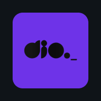

 

    
| Resume Contribution | Languages Experience |
| ------------------- | -------------------- |
|    |  |
    

 
 <picture></picture>
  
<h2 align="center">Oi, eu sou Caio Cezar Bezerra</h2>

Desenvolvedor de São Paulo-SP. 
Atuo na área de desenvolvimento desde 2023 sempre buscando novos desafios e aprendizado. Melhorando a cada dia em busca de códigos mais limpos e organizados.  
Estou sempre aberto para dicas e criticas construtivas, sinta-se convidado a opinar.

| Total Contribution | Time-based Languages |
| ------------------ | ------------------ |
|  |  |

    
| Instagram | LinkedIn | Rocketseat | DIO | Twitter |
| --------- | -------- | ------- | ---------- | --- |
|  |   |  |  | 

  
 
